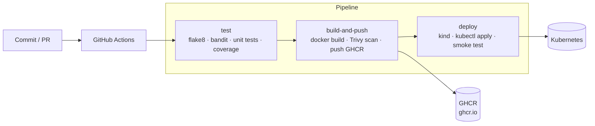
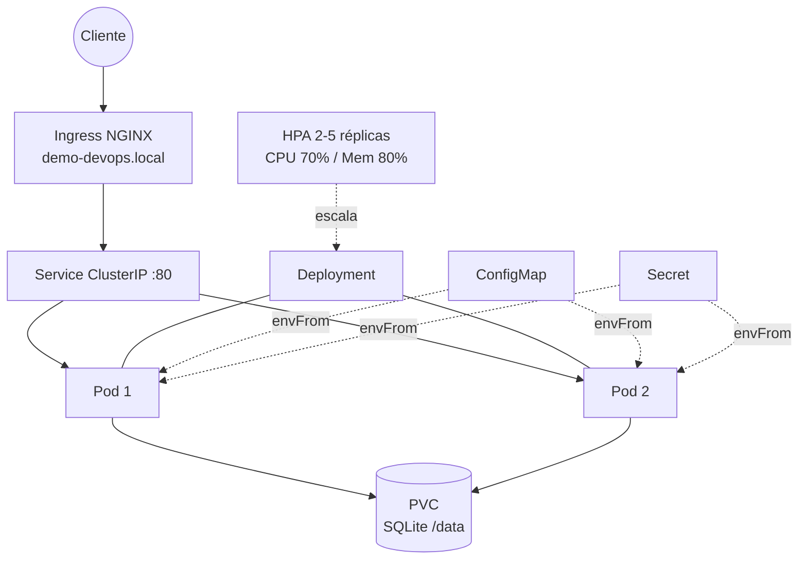

# Demo DevOps Python

API REST de gestión de usuarios (Django REST Framework) empaquetada y desplegada
siguiendo prácticas DevOps: imagen Docker reforzada, pipeline CI/CD como código y
despliegue en Kubernetes con alta disponibilidad y autoescalado.

La aplicación base proviene de la prueba técnica de Devsu. Sobre ella se añadió todo
lo relativo a contenerización, integración/entrega continua e infraestructura.

## Enlaces

- **Repositorio:** https://github.com/Crberrio2/demo-devops-python
- **Pipeline (GitHub Actions):** https://github.com/Crberrio2/demo-devops-python/actions
- **Evidencia del pipeline:** [docs/PIPELINE.md](docs/PIPELINE.md)
- **Imagen (GHCR):** `ghcr.io/crberrio2/demo-devops-python:latest`

> No se publicó un endpoint permanente (el ejercicio permite un entorno local). El
> despliegue en Kubernetes se valida automáticamente en cada ejecución del pipeline
> sobre un cluster `kind` efímero, y puede levantarse en local con `make k8s-deploy`.

## Contenido

- [Arquitectura](#arquitectura)
- [Decisiones de diseño](#decisiones-de-diseño)
- [Ejecución local](#ejecución-local)
- [Docker](#docker)
- [Pipeline CI/CD](#pipeline-cicd)
- [Despliegue en Kubernetes](#despliegue-en-kubernetes)
- [Consideraciones de producción](#consideraciones-de-producción)
- [API](#api)

## Arquitectura

### Flujo CI/CD



### Topología en Kubernetes



## Decisiones de diseño

| Tema | Decisión | Motivo |
|------|----------|--------|
| Servidor de aplicación | Gunicorn (3 workers) en lugar de `runserver` | `runserver` es solo para desarrollo; Gunicorn es WSGI productivo. |
| Imagen | Multi-stage sobre `python:3.11.3-slim` | Imagen final pequeña, sin toolchain de compilación. |
| Usuario | Proceso como usuario no-root (uid 1001) | Reduce superficie de ataque; requerido por `runAsNonRoot`. |
| Configuración | 12-factor: variables de entorno (`django-environ`) | Misma imagen en cualquier entorno; sin secretos en el código. |
| Estáticos | WhiteNoise + `collectstatic` en build | Sirve estáticos sin un nginx adicional con `DEBUG=False`. |
| Healthchecks | Endpoints `/api/health/live/` y `/api/health/ready/` | `liveness` valida proceso; `readiness` valida la base de datos. |
| Base de datos | SQLite en un PVC | Se mantiene la BD original; ver [limitaciones](#consideraciones-de-producción). |
| Registro de imágenes | GitHub Container Registry (GHCR) | Gratuito para repos públicos e integrado con Actions. |
| Análisis estático | flake8 (estilo) + bandit (seguridad) | Sin servicios externos; ejecutable en cualquier runner. |
| Despliegue en CI | Cluster `kind` efímero | Prueba real y pública del despliegue sin infraestructura permanente. |

## Ejecución local

Requisitos: Python 3.11.

```bash
pip install -r requirements-dev.txt
cp .env.example .env
python manage.py migrate
python manage.py test
python manage.py runserver
```

Abrir http://localhost:8000/api/

## Docker

```bash
docker build -t demo-devops-python:local .

docker run --rm -p 8000:8000 \
  -e DJANGO_SECRET_KEY=local-secret \
  demo-devops-python:local
```

La imagen:

- corre como usuario no-root (uid 1001),
- expone el puerto 8000,
- define `HEALTHCHECK` contra `/api/health/live/`,
- aplica migraciones en el arranque (`entrypoint.sh`) y luego ejecuta Gunicorn.

Verificar salud del contenedor:

```bash
docker inspect --format '{{.State.Health.Status}}' <container_id>
curl http://localhost:8000/api/health/live/
```

## Pipeline CI/CD

Definido en [`.github/workflows/ci-cd.yaml`](.github/workflows/ci-cd.yaml). Se ejecuta en
cada push y PR a `main`.

| Job | Pasos |
|-----|-------|
| `test` | Code build, flake8, bandit (análisis estático de seguridad), unit tests y **code coverage**. |
| `build-and-push` | Docker build, **escaneo de vulnerabilidades con Trivy** (CRITICAL/HIGH) y push de la imagen a GHCR. |
| `deploy` | Levanta un cluster `kind`, instala el Ingress NGINX, carga la imagen, aplica los manifiestos con Kustomize, espera el rollout y hace un smoke test. |

El push de la imagen y el deploy se omiten en Pull Requests (solo validación).

## Despliegue en Kubernetes

Los manifiestos están en [`k8s/`](k8s/) y se gestionan con Kustomize.

| Recurso | Archivo | Función |
|---------|---------|---------|
| Namespace | `namespace.yaml` | Aísla la aplicación. |
| ConfigMap | `configmap.yaml` | Configuración no sensible (`DEBUG`, hosts, ruta de BD). |
| Secret | `secret.yaml` | `DJANGO_SECRET_KEY`. |
| PVC | `pvc.yaml` | Persistencia de la BD SQLite. |
| Deployment | `deployment.yaml` | 2 réplicas, probes, límites de recursos, securityContext. |
| Service | `service.yaml` | ClusterIP interno. |
| Ingress | `ingress.yaml` | Exposición HTTP vía NGINX. |
| HPA | `hpa.yaml` | Autoescalado horizontal 2→5 réplicas. |

### Despliegue local (docker-desktop / minikube)

```bash
kubectl apply -k k8s/
kubectl -n demo-devops rollout status deployment/demo-devops-python
kubectl -n demo-devops get pods,svc,ingress,hpa
```

Acceso por Ingress (añadir `demo-devops.local` a `/etc/hosts` apuntando a la IP del Ingress)
o por port-forward:

```bash
kubectl -n demo-devops port-forward svc/demo-devops-python 8080:80
curl http://localhost:8080/api/users/
```

### Seguridad y disponibilidad aplicadas

- `runAsNonRoot`, `readOnlyRootFilesystem`, `allowPrivilegeEscalation: false`, `drop ALL` capabilities.
- Requests/limits de CPU y memoria.
- `readinessProbe` (valida BD) y `livenessProbe` (valida proceso).
- `RollingUpdate` con `maxUnavailable: 0` para despliegues sin downtime.

## Consideraciones de producción

- **SQLite y múltiples réplicas.** SQLite es un archivo y no admite escrituras concurrentes
  desde varios pods. Funciona en este ejercicio (un solo nodo, PVC `ReadWriteOnce`), pero en
  producción real **se recomienda PostgreSQL** (RDS/Cloud SQL o un operador). El código ya lee
  la base de datos por variables de entorno, por lo que migrar requiere cambiar `ENGINE`,
  añadir el driver y apuntar a un Secret con las credenciales.
- **Gestión de secretos.** El `Secret` de ejemplo trae un valor placeholder. En producción usar
  Sealed Secrets, External Secrets Operator o el gestor del proveedor cloud; nunca versionar
  secretos reales.
- **TLS / DNS.** Para un dominio público: gestionar el DNS hacia el Ingress y emitir certificados
  con cert-manager + Let's Encrypt (anotaciones TLS en el Ingress).
- **Observabilidad.** Añadir Prometheus/Grafana (el HPA ya requiere metrics-server) y agregación
  de logs.

## API

### Crear usuario — `POST /api/users/`

```json
{ "dni": "dni", "name": "name" }
```

Respuesta `201`:

```json
{ "id": 1, "dni": "dni", "name": "name" }
```

Errores: `400` si el DNI ya existe o faltan campos.

### Listar usuarios — `GET /api/users/`

```json
[ { "id": 1, "dni": "dni", "name": "name" } ]
```

### Obtener usuario — `GET /api/users/<id>/`

`200` con el usuario, o `404` si no existe.

### Salud

- `GET /api/health/live/` → `{ "status": "ok" }`
- `GET /api/health/ready/` → `{ "status": "ready" }` (verifica la base de datos)

## Licencia

Copyright © 2023 Devsu. All rights reserved.
